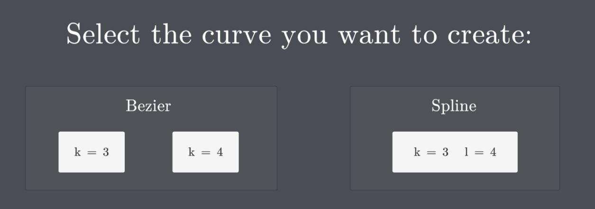
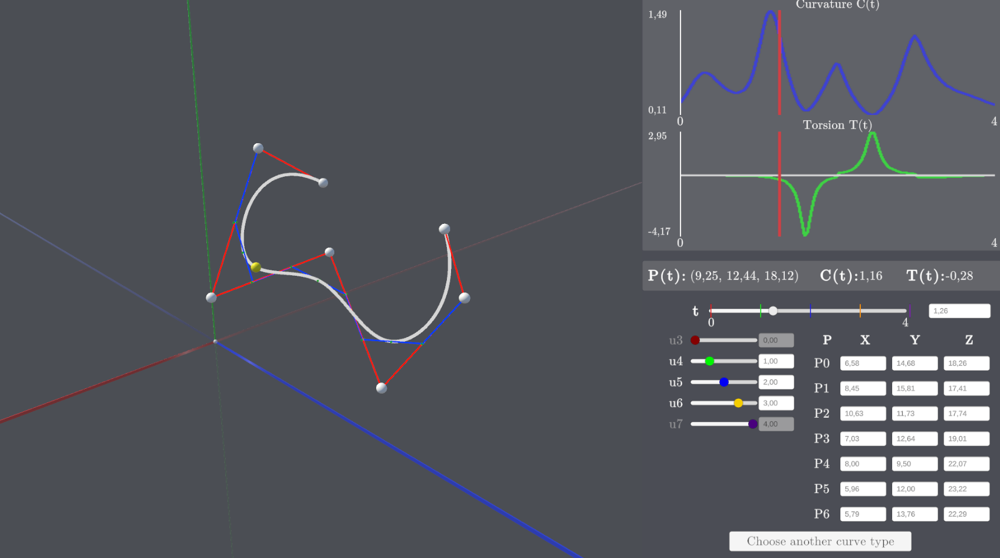
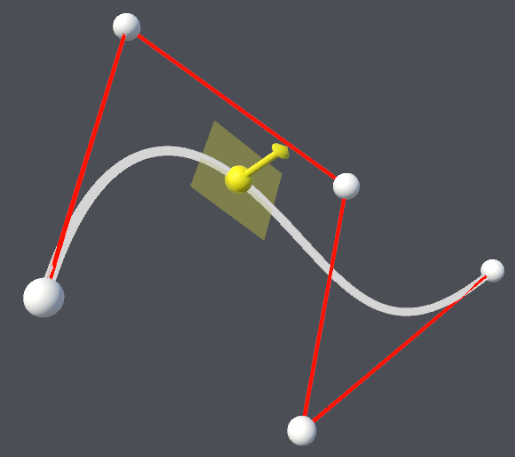
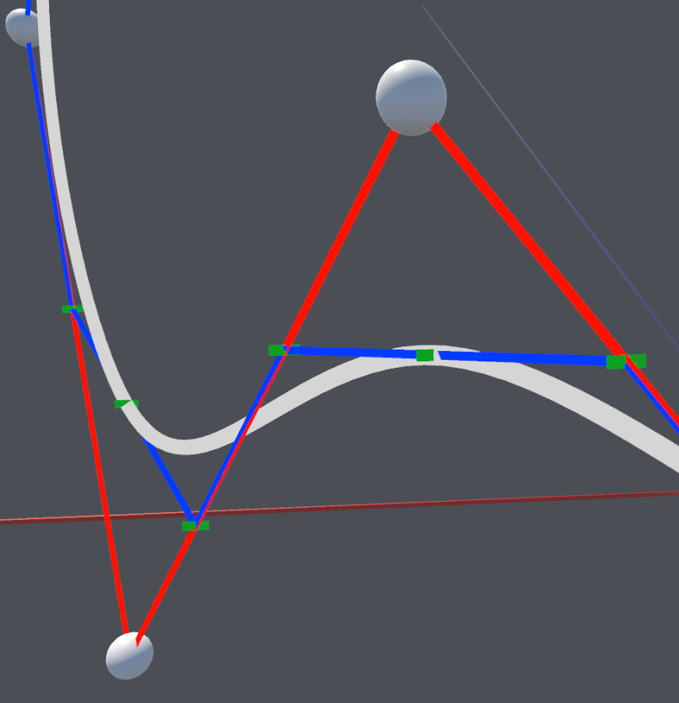
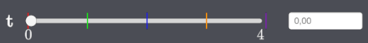
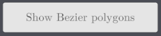

# Manuale utente
## Menu principale

All'avvio l'applicazione presenta un menu con tre opzioni possibili di creazione di curve:
+ Curva di Bezier di grado 3 (Bottone k = 3)
+ Curva di Bezier di grado 4 (Bottone k = 4)
+ Curva B-Spline di grado 3 con quattro incollamenti di curve di Bezier (Bottone k = 3 l = 4)

Per selezionare il tipo di curva desiderata cliccare sul bottone corrispondente.

## Ambienti di creazione

Tutti e tre i possibili ambienti di creazione si presentano con un menu a pannelli a destra contente i dati della curva e uno spazio 3D a sinistra contenente la curva ed evidenziato dal sistema di riferimento indicato come segue:
+ Asse X in rosso
+ Asse Y in verde
+ Asse Z in blu
+ Origine: pallino bianco

**Nota bene**: la sezione di asse positiva ha un colore più brillante rispetto a quella negativa.

In queste interfacce sarà possibile svolgere quattro operazioni principali.

### Creazione della curva
All’apertura di un ambiente di creazione la curva può essere creata posizionando i punti di controllo del poligono (4 per le Bezier di grado 3, 5 per le Bezier di grado 4, 7 per le B-Spline) nello spazio 3D (vedi sezione Spazio 3D). 

Sarà possibile eseguire questa operazione in due modi:
+ Cliccando con il mouse in un punto dello spazio 3D
+ Digitando le coordinate XYZ per ogni punto di controllo nel pannello corrispondente (vedi sezione Pannello dei punti di controllo) 

La curva si creerà autonomamente sulla base dei punti di controllo generati.

### Visualizzazione della curva
Alla creazione della curva, la telecamera punterà sempre al centro di essa. Per visualizzarla da diverse angolazioni è possibile agire sulla telecamera in questi modi: 
+ Premendo A per ruotare verso sinistra
+ Premendo D per ruotare verso destra
+ Premendo W per ruotare verso l'alto
+ Premendo S per ruotare verso il basso
+ Facendo scorrere la rotella del mouse in avanti per avvicinarsi, o con gesture da touchpad
+ Facendo scorrere la rotella del mouse indietro per allontanarsi, o con gesture da touchpad

### Modifica della curva
Una volta creata, la curva potrà essere modificata agendo in tre modi distinti:
+ Tenendo premuto con il mouse su un punto di controllo questo può essere trascinato in un punto a piacere dello spazio. Funziona anche tenendo premuto il punto e spostando la camera.
+ Inserendo un valore specifico per le coordinate X, Y o Z di un punto di controllo nel pannello (vedi sezione Pannello dei punti di controllo) il corrispondete punto si sposterà nella posizione desiderata.
+ ***Solo per le B-Spline***: modificando il valore di uno dei nodi della curva utilizzando il pannello corrispondente (vedi sezione Pannello dei nodi)

Lo spostamento dei punti di controllo modificherà automaticamente il poligono di controllo e dunque la curva risultante.

***Per le B-Spline:*** lo spostamento dei nodi modificherà autonomamente il poligono di Bezier sotteso e dunque la curva risultante.

### Analisi della curva
La curva presente a schermo può essere analizzata utilizzando i pannelli presenti nel menu a destra di ogni ambiente di creazione. Per maggiori dettagli leggere la sezione Menu a pannelli.

## Spazio 3D

Lo spazio 3D posizionato sul lato sinistro di ogni ambiente di creazione conterrà la visualizzazione della curva prescelta. I cui elementi saranno:
+ Pallini bianchi: punti di controllo della curva (interagibili)
+ Segmenti rossi: lati del poligono di controllo della curva
+ Linea bianca: la curva risultante
+ Pallino giallo: marker identificativo di un punto specifico della curva
+ Freccia gialla: vettore binormale
+ Piano giallo: piano osculatore

***Solo per B-Spline:*** 
+ Linee blu: poligoni di controllo di Bezier
+ Trattini verdi: punti di controllo di Bezier

## Menu a pannelli
Il menu a pannelli posizionato sul lato destro di ogni ambiente di creazione permette di interagire con la curva e analizzarne i valori matematici. 

**Nota bene**: dopo l'interazione con un pannello cliccare in un punto generico dello spazio 3D per deselezionare il pannello.

### Pannello di curvatura e torsione

Questo pannello permette di visualizzare, successivamente alla creazione della curva, i grafici di curvatura e torsione per ogni punto della curva lungo il suo dominio. Sull’asse Y sono presenti le etichette dei valori minimo (in basso) e massimo (in alto) dei rispettivi grafici.

La linea rossa rappresenta la corrispondenza con un punto specifico del dominio.

### Pannello dei punti di controllo

Questo pannello permette di creare (se non sono ancora stati creati) i punti di controllo o modificarne le coordinate XYZ (se già presenti), cliccando sulla corrispondente casella e inserendo un valore numerico.

**Nota bene**: l’approssimazione dei valori da inserire nella caselle è in centesimi e i numeri decimali vanno inseriti con la , e non con il .

### Pannello dei nodi

Presente solo nell’ambiente delle B-Spline, questo pannello permette di modificare la posizione dei nodi della curva sul dominio. Tenendo premuto con il tasto sinistro del mouse sul pallino dello slider e trascinando a destra e sinistra oppure inserendo un valore specifico nella casella a lato è possibile modificare la posizione del corrispondente nodo sul dominio.

**Nota bene**: per rispettare la coerenza matematica i nodi u0 e u4 non sono interagibili ma sono comunque mostrati per chiarezza di lettura. Inoltre il valore del nodo selezionato non potrà mai diventare minore di quello del nodo precedente o maggiore di quello successivo, o uguale ad entrambi.

**Nota bene**: l’approssimazione dei valori da inserire nella caselle è in centesimi e i numeri decimali vanno inseriti con la , e non con il .

### Pannello del dominio della curva

Questo pannello ti permette di indagare un valore specifico della curva secondo il dominio. 

Tenendo premuto con il tasto sinistro del mouse sul pallino dello slider e trascinando a destra e sinistra, oppure inserendo un valore specifico della casella a lato è possibile scorrere lungo il dominio della curva.

Una volta scelto un valore del dominio nel pannello sovrastante verranno mostrati rispettivamente:
+ Le coordinate XYZ del punto della curva corrispondente (identificato anche sulla curva dal pallino giallo, vedi sezione Spazio 3D)
+ Il valore di curvatura nel punto (identificato anche sul grafico dalla linea rossa vedi sezione Pannello di curvatura e torsione)
+ Il valore di torsione nel punto (identificabile anche sul grafico dalla linea rossa, vedi sezione Pannello di curvatura e torsione)

***Solo per B-Spline***: sullo slider sono presenti anche 5 barrette verticali (presenti a scopi di visualizzazione e non interagibili) raffiguranti la posizione dei 5 nodi della curva sul dominio. Al variare dei nodi varierà anche la posizione di queste barrette. La corrispondenza tra nodi e barrette è data dal color coding:
+ Rosso: u0
+ Verde: u1
+ Blu: u2
+ Giallo: u3
+ Viola: u4

**Nota bene**: l’approssimazione dei valori da inserire nella caselle è in centesimi e i numeri decimali vanno inseriti con la , e non con il .

## Bottoni

### Bottone di visualizzazione di piano osculatore e binormale

Premendo questo bottone sarà possibile attivare o disattivare la visibilità del piano osculatore e del vettore binormale nel punto selezionato dal pannello del dominio (vedi sezione Pannello del dominio della curva)

### Bottone di visualizzazione dei poligoni di controllo di Bezier

Premendo questo bottone sarà possibile attivare o disattivare la visibilità dei quattro poligoni di controllo di Bezier, legati alle quattro curve incollate.

### Bottone di ritorno

Premendo questo bottone, presente in basso, sarà possibile tornare al menu principale di selezione della curva.
